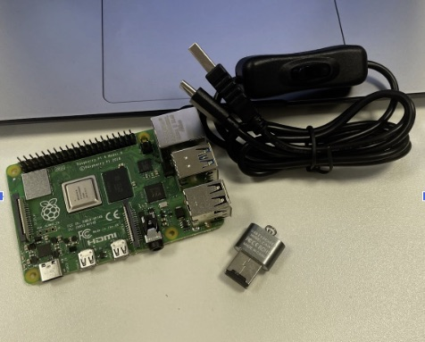
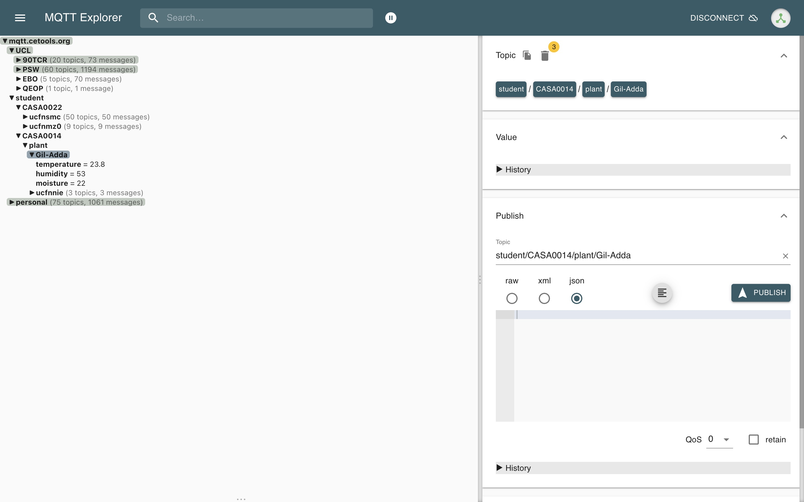
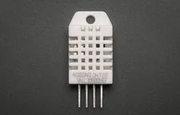
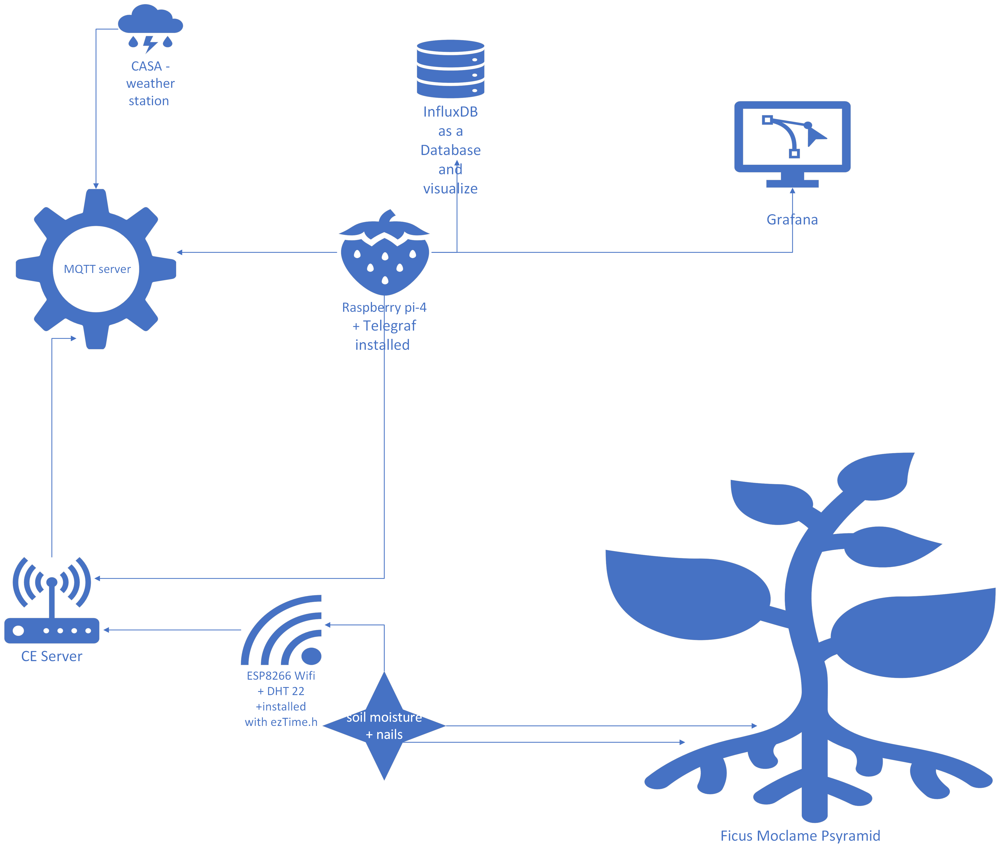

# Overview
personal plant monitor to keep my lovely plant alive - by monitoring air temperature, air humidity, soil moisture. 
The choosen plant is ficus Moclame pyramid https://www.patchplants.com/gb/en/plants/ficus-microcarpa-moclame-780/ 

Through this process, I found that there are many ways to connect plants to the internet. 
The main tools that we used are two devices Raspberry Pi-4, Adafruit Feather HUZZAH ESP8266 Wifi with the DHT 22 Sensor temperature and humidity sensor, 2 Nails, and wired for more technical details, you can watch my git repository. Furthermore, for DIY plant monitors is no need to use MQTT or the weather station. 

# Plant-monitor additional parts 
1. 2 design part for covering the Feather Huzzah board 
2. MicroUSB for power Huzzah board
3. Wierd for connecting the nails to the Feather Huzzah  
4. 2 nails as a soil pin
5. DHT 22 Sensor temperature and humidity sensor

  

4. Raspberry Pi-4, 5V power supply, microSD card
  

# Workspace
1. Shell (Terminal)
To use "sudo" command for first update the hostname of the R-Pi
For connecting to the RPi and configure the communication between (telegraf, InfluxDB, grafana)
and to connect to the weather station of casa for getting real time outdoor temperature and humidity

2. Arduino IDE 2.0.1 
(for download the libararies and and connecting to the MQTT) 

# MQTT side of the project 
Adafruit Feather HUZZAH ESP8266 Wifi communicate MQTT 
   

 
 
 
Raspberry pi communicate with MQTT 
   
 

# Hardware 
 1. Adafruit Feather HUZZAH ESP8266  Wifi 
 To convert the data to be analog and send that to the MQTT server  
 2. Raspberry Pi 4 play as a computer (install Raspberyy Pi OS 64 bit - https://www.raspberrypi.com/software/)
 Attached picture while install the Rpi and configure our wifi connection hostname and the username and the password for the Rpi
 
 [Rpi during install](IMG/Rpi-SD.jpeg)

 4. DHT 22 Sensor temperature and humidity sensor 

   
 

 
 
 # Software backend 
 telegraf is the reader of the data that install on the Raspberry pi. 
 the telegraf gather the data from the MQTT Broker and send that to the Influxdb 
 
 Influxdb is the database that store the data in "buckets" and can show it on dashboard as well. 
  
 grafana useing as a display for the data that came from the Influxdb 
 grafana analyze the data and allow to make query and display dashboards with the key data 

 
 # The Arcitecture
 The Architecture is for my current project I'm sure that yours can be a bit diffrent but the main parts are the plant monitor and the Rpi that both can be connect to personal computer. 
 
In my project as it can be seen the RPi was installed with telegraf to the Local server to the INflux and to the grafana. 
The role of telegraf is to commmunicate in a efficient way with the MQTT and to daliver to the influxDD and grafana 

 
 
  
 
 
 
 
 # About the data 
 
 Raspberry Pi connecting to the CE-server and the data from HUZZAH flow via the CE server to R-Pi and manage it to communicate with telegraf and InfluxB by using Token. 
 Notice: the browsers of Influx and grafana will work just when the R-pi powerd.  
the data store in the InfluxDB that convert by telegraf
 
 the qery about the data is it possible to do with InfluxDB and with grafana 
 My link to the grafana browser http://stud-pi-zczlgad.celab:8086/
 
   
 
 
 The picture in the buttom is the graph of the weater station of CASA and i connect to that as well to compare with my humidiy in the room and compare to  the temperature. 
 That can allow me todo more reaserch in the data and to make more accurate decisions that relate to the location and local condition that the plant put.
   
 
 

# hello world 
