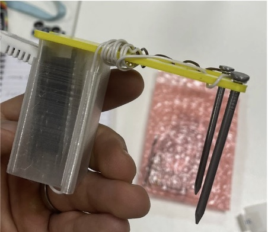
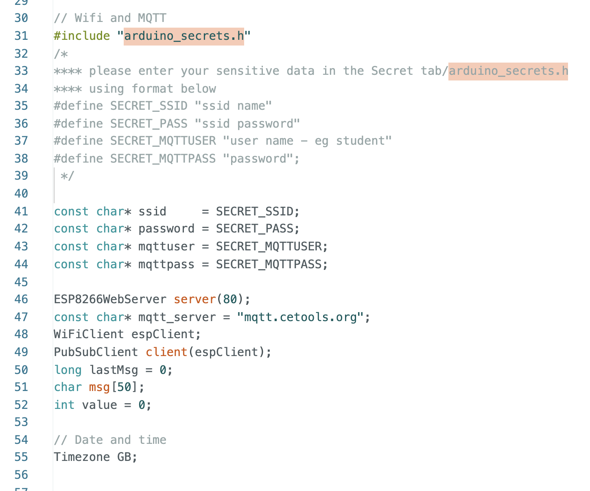
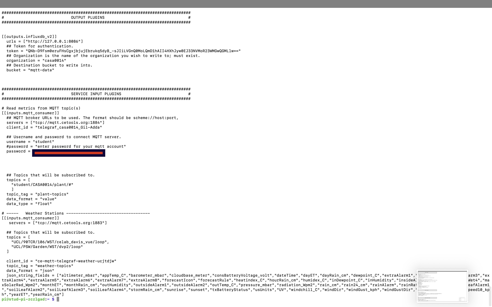
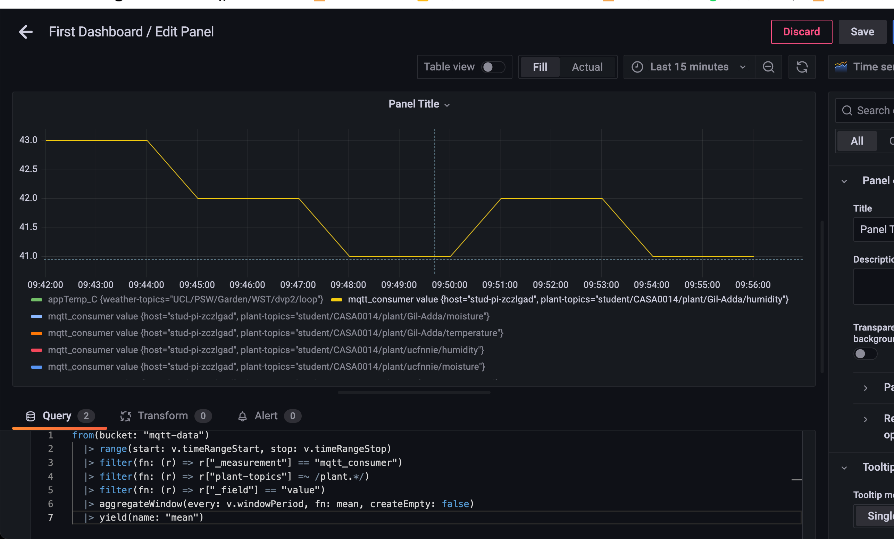
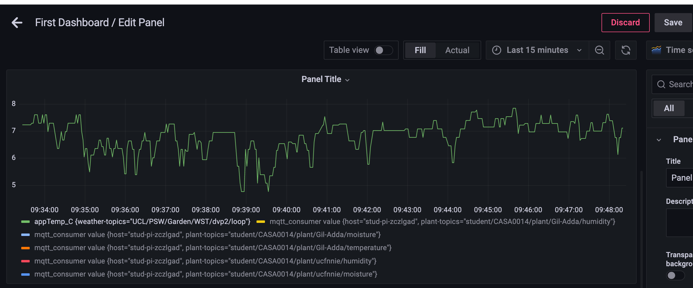

# Overview
personal plant monitor to keep my lovley plant alive - with monitoring air temperature, air humidity, soil moisture. 
the choosen plant is ficus moclame pyramid https://www.patchplants.com/gb/en/plants/ficus-microcarpa-moclame-780/ 

# Plant-monitor adisional parts 
1. 2 design part for covering the Feather Huzzah board 
2. wierd for connecting the nails to the Feather Huzzah  
3. 2 nails as a soil pin

The tools that we use are Raspberry Pi-4, 5V power supply, microSD card, Adafruit Feather HUZZAH ESP8266 Wifi, DHT 22 Sensor temperature and humidity sensor

# Workspace
Thouse are for installing the 
1. Shell (Terminal)
For connecting to the RPi and configure the communication between (telegraf, InfluxDB, grafana)
and to connect to the weather station of casa for getting real time outdoor temperature and humidity

3. Arduino IDE 2.0.1 
(for download the libararies and and connecting to the MQTT) 

# MQTT side of the project 
Adafruit Feather HUZZAH ESP8266 Wifi communicate MQTT 
 
 
Raspberry pi communicate with MQTT 

# Hardware 
 1. Adafruit Feather HUZZAH ESP8266  Wifi 
 To convert the data to be analog and send that to the MQTT server  
 2. Raspberry Pi 4 play as a computer (install Raspberyy Pi OS 64 bit - https://www.raspberrypi.com/software/
 3. DHT 22 Sensor temperature and humidity sensor
 
 
 
 
 
 # software backend 
 telegraf is the reader of the data that install on the Raspberry pi. 
 the telegraf gather the data from the MQTT Broker and send that to the Influxdb 
 
 Influxdb is the database that store the data in "buckets" and can show it on dashboard as well. 
  
 grafana useing as a display for the data that came from the Influxdb 
 grafana analyze the data and allow to make query and display dashboards with the key data 
 
 what is the diffrent between thouse platform ? 
 
 # The Arcitecture

 
 # About the data 
 the data store in the InfluxDB that convert by telegraf
 the qery about the data is it possible to do with InfluxDB and with grafana 
 
 
 
 
 
 # Part one 

 

# hello world 
